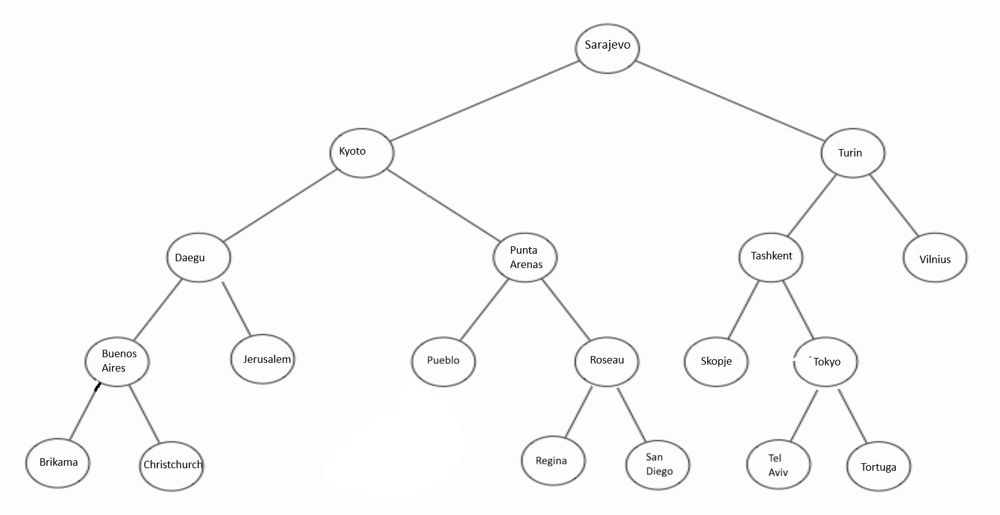

# Struktura binary tree v javě
Semestrální práce z předmětu Datové struktury zaměřená na tvorbu struktury binárního stromu s využitím
* Iterátoru do šířky/hloubky
* Vkládání do struktury pomocí comparable rozhraní
* Prohlídka struktury dle **IN-ORDER**
* Zásobníku **LIFO/FIFO** interpretovaného jako **non-cyclic double-linked-list**
* JavaFx knihoven pro základní operaci s vytvořenou agendou **AgendaKraj** 

### Vzorová ukázka binárního stromu naplněného testovacími daty
